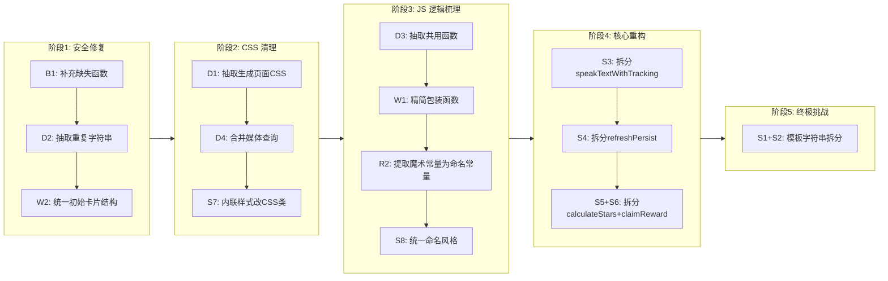

# 代码审查报告（Code Review）

> 审查范围：`index.html`、`style.css`、`script.js`
> 工作目标：找出屎山代码，提供分步重构计划

---

## 一、发现的问题清单

### 🐛 Bug（实际错误）

| # | 问题 | 文件 | 说明 |
|---|------|------|------|
| B1 | **缺失函数 `onDetectiveChancesChange`** | [`index.html:61`](../index.html:61) | HTML 中 `onchange="onDetectiveChancesChange()"` 引用了一个不存在的函数。在 `script.js` 中全局搜索无匹配。用户修改侦探机会输入框时，没有任何逻辑被执行。虽然当前 `updateDetectiveChances()` 在勾选陷阱时会自动覆写该值，但手动修改后本应有额外逻辑。 |

### 🧹 重复代码

| # | 问题 | 文件 | 说明 |
|---|------|------|------|
| D1 | **CSS 样式重复** | [`script.js:253-349`](../script.js:253) vs [`style.css`](../style.css) | `generatePage()` 内嵌的模板字符串包含一整套 `<style>` 块，其中大量样式（如 `body { max-width: 600px; ... }`、`@media` 查询等）与 `style.css` 中定义的样式重复。一旦需要修改样式，必须同时修改两处。 |
| D2 | **文本字符串重复** | [`script.js:48-49`](../script.js:48) vs [`script.js:145`](../script.js:145) vs [`index.html:30`](../index.html:30) | 英文段落 placeholder 文本 `'英文段落 (支持多行及 M:/F: 角色标记)'` 在 JS、HTML 模板、IIFE 中出现了至少 3 次。 |
| D3 | **排序按钮 HTML 重复** | [`script.js:40-43`](../script.js:40) vs [`script.js:75-78`](../script.js:75) | `addCard()` 和 `addExplanationBox()` 中创建排序按钮的 `innerHTML` 完全一样，可以提取为共用函数。 |
| D4 | **媒体查询中的重复声明** | [`style.css:242-260`](../style.css:242) | `@media (max-width: 768px)` 和 `@media (max-width: 480px)` 中有大量重复的属性（如 `.sort-buttons`、`.sort-btn`、`.delete-card-btn` 的尺寸），部分值仅在数值上微调。 |

### 🗑️ 废弃/冗余代码

| # | 问题 | 文件 | 说明 |
|---|------|------|------|
| W1 | **冗余的 `getStats()` 和 `getTrapState()` 包装函数** | [`script.js:507-508`](../script.js:507) | 这两个函数只是 `appState.stats` 和 `appState.trapsState[cardIndex]` 的一层薄包装，增加了间接性，但并未提供额外逻辑（如默认值处理）。几乎所有调用处仍然直接访问 `appState` 对象。 |
| W2 | **IIFE 中操作初始卡片的 `eng-label` 逻辑** | [`script.js:137-151`](../script.js:137) | 这段代码是为了给 HTML 中预置的初始卡片动态添加 `<label class="eng-label">`。但 `addCard()` 函数创建卡片时已经包含了这个 label。这意味着初始卡片结构与其他卡片不一致。更好的做法是让初始卡片直接包含 label。 |
| W3 | **`sessionStartTime` 变量** | [`script.js:445`](../script.js:445) | 这个变量只在 `revealChinese()` 中初始化，在 `handleRevealBtn()` 中使用。但如果用户刷新页面后重新点击"再次朗读"，`sessionStartTime` 是上一次的值，逻辑上可能不准确。其用途是计算首次思考时间，但恢复状态后该值可能不准确。 |
| W4 | **`cardsContainer` 闭包变量"影子"使用** | [`script.js:5`](../script.js:5) | `cardsContainer` 在 IIFE 内被缓存，但 `moveCardUp`、`moveCardDown`、`addCard`、`addExplanationBox` 等函数都通过闭包引用了它。这些函数都挂载在 `window` 上，依赖 IIFE 闭包正常工作。不是严格意义上的问题，但多人协作时容易出错。 |

### 🌀 逻辑混乱/难以维护

| # | 问题 | 文件 | 说明 |
|---|------|------|------|
| S1 | **`generatePage()` 函数过于庞大（1000+ 行）** | [`script.js:159-1279`](../script.js:159) | 一个函数内完成了：读取表单、生成 content hash、遍历卡片生成 HTML、嵌入完整的 CSS 和 JS 模板。整个生成的页面（含样式和脚本）被放在一个巨大的模板字符串中。这是**最大的屎山**——无法语法高亮、无法 lint、无法断点调试。 |
| S2 | **模板字符串内的 JS 代码无法被工具链检查** | [`script.js:394-1273`](../script.js:394) | 生成的页面中包含的 `<script>` 代码（约 880 行）被包裹在 JS 模板字符串中，IDE 无法对其做语法检查、自动补全或重构。任何修改都可能引入难以发现的错误。 |
| S3 | **`speakTextWithTracking()` 函数职责过多** | [`script.js:898-969`](../script.js:898) | 该函数同时处理：语音合成、按钮状态管理、能量条更新、陷阱自动暴露逻辑（two-strike）、统计保存。回调嵌套深，逻辑分支多，难以单元测试。 |
| S4 | **`refreshPersist()` 函数职责过多** | [`script.js:1176-1243`](../script.js:1176) | 该函数同时恢复：中文翻译状态、英文显示状态、按钮状态、能量条、陷阱捕获后的文本替换、侦探模式视觉状态。各种 if 嵌套，逻辑路径复杂。 |
| S5 | **`calculateStars()` + `claimReward()` 耦合过紧** | [`script.js:1009-1052`](../script.js:1009) + [`script.js:1095-1166`](../script.js:1095) | `claimReward()` 内部又做了一次与 `calculateStars()` 相似的星级逻辑判断（如 `hasMasteryBased`），导致评星逻辑分散在两处。 |
| S6 | **`claimReward()` 函数混合了 UI 渲染和数据逻辑** | [`script.js:1095-1166`](../script.js:1095) | 该函数同时做：星级计算、DOM 操作（显示星星）、消息选择、文件名生成、Blob 下载、滚动定位。应有更好的分离。 |
| S7 | **内联样式混在 JS 中** | [`script.js:881`](../script.js:881) | `btn.style.backgroundColor = '#4CAF50'` 直接在 JS 中设置样式，而不是通过切换 CSS 类来控制。类似问题在多个地方出现。 |
| S8 | **变量命名风格不统一** | [`script.js:666`](../script.js:666) | `_reportTrapBusy` 使用了 snake_case 和下划线前缀，而其他变量均使用 camelCase。 |

### ⚠️ 潜在维护风险

| # | 问题 | 文件 | 说明 |
|---|------|------|------|
| R1 | **硬编码的语音关键词列表** | [`script.js:807-808`](../script.js:807) | `maleKeywords` 和 `femaleKeywords` 数组中硬编码了大量语音名称。不同操作系统/浏览器的语音列表不同，这些列表可能过时。 |
| R2 | **魔术数字散落各处** | 多个位置 | 如 `300`ms 防抖超时、`120` 个纸屑数量、`150` 帧动画上限、`0.7` 默认语速等，没有定义为常量。 |
| R3 | **`alert()` 和自定义提示混用** | 多个位置 | 部分错误提示用 `alert()`（如 `script.js:872`），部分用 `showHint()`（如 `script.js:691`），部分用 `showPersistentHint()`（如 `script.js:1000`）。用户体验不统一。 |

---

## 二、分步重构计划

以下步骤按**风险从低到高**排列，建议依次执行，每步完成后测试一次，确保功能正常。



### 阶段 1：安全修复（无风险，可直接执行）

**Step 1.1** — 补充缺失函数 `onDetectiveChancesChange`
- 在 [`script.js`](../script.js) 的 IIFE 中添加 `window.onDetectiveChancesChange = function() { ... }`
- 功能：当用户手动修改侦探机会数时，应做什么？当前行为是 `updateDetectiveChances()` 在勾选陷阱时会自动覆写该值。建议该函数用于允许用户手动调整（覆盖自动计算的值），或至少不应让用户修改后被自动值覆盖。

**Step 1.2** — 统一重复字符串为常量
- 将 `'英文段落 (支持多行及 M:/F: 角色标记)'` 提取为一个常量（如 `ENGLISH_LABEL_TEXT`）
- 在 HTML 的初始卡片、`addCard()`、IIFE 初始逻辑中统一引用

**Step 1.3** — 统一初始卡片结构
- 修改 [`index.html`](../index.html) 中的初始卡片，直接添加 `<label class="eng-label">`，与 `addCard()` 生成的卡片结构一致
- 移除 [`script.js:137-151`](../script.js:137) 中动态添加 label 的 IIFE 逻辑

### 阶段 2：CSS 清理

**Step 2.1** — 抽取生成页面的 CSS 到独立文件（或至少消除重复）
- 选项 A（推荐）：新建 `generated-style.css`，将模板中的 CSS 移入，在模板字符串中通过 `<link>` 引用
- 选项 B（保守）：将模板 CSS 中与 `style.css` 重复的部分删除，只保留必要的差异部分
- 目标：一处修改，处处生效

**Step 2.2** — 合并和精简媒体查询
- 将 `@media (max-width: 768px)` 和 `@media (max-width: 480px)` 中重复的声明合并，使用更少的覆盖点
- 使用 CSS 变量（custom properties）管理重复的尺寸值

**Step 2.3** — 内联样式改为 CSS 类
- 搜索 `script.js` 中所有 `.style.xxx =` 的赋值，改为通过 `classList.add/remove/toggle` 控制
- 例如 `btn.style.backgroundColor = '#4CAF50'` → `btn.classList.add('btn-green')`

### 阶段 3：JS 逻辑梳理

**Step 3.1** — 抽取排序按钮创建逻辑
- 将 [`script.js:40-43`](../script.js:40) 中排序按钮的 `innerHTML` 抽取为一个函数 `createSortButtonsHTML()`，在 `addCard()` 和 `addExplanationBox()` 中复用

**Step 3.2** — 精简冗余包装函数
- 考虑移除 `getStats()` 和 `getTrapState()` 的包装层，或者为它们添加真正的价值（如默认值处理 + 防御性编程）

**Step 3.3** — 提取魔术数字为命名常量
- 创建一个 `CONSTANTS` 对象（或在文件顶部添加 `const` 声明）：
  - `DEBOUNCE_DELAY = 300`
  - `CONFETTI_COUNT = 120`
  - `CONFETTI_MAX_FRAMES = 150`
  - `DEFAULT_RATE = 0.7`
  - `MAX_ENERGY = 3`
  - `TWO_STRIKE_LIMIT = 2`

**Step 3.4** — 统一命名风格
- 将 `_reportTrapBusy` 改为 `reportTrapBusy`

### 阶段 4：核心 JS 重构（中度风险）

**Step 4.1** — 拆分 `speakTextWithTracking()`
- 提取以下子函数：
  - `createUtterance(text, gender, rate)` — 创建语音实例
  - `handleSpeechEnd(...)` — 播放结束后的回调逻辑
  - `updateSpeechButton(btn, state)` — 按钮状态管理
  - `handleTwoStrikeLogic(cardIndex)` — 两次错读自动暴露逻辑

**Step 4.2** — 拆分 `refreshPersist()`
- 提取：
  - `restoreStatsUI(card, statItem)` — 恢复统计相关 UI
  - `restoreTrapUI(card, trapState)` — 恢复陷阱相关 UI
  - `restoreDetectiveUI(card, trapState)` — 恢复侦探模式 UI

**Step 4.3** — 拆分 `calculateStars()` + `claimReward()`
- 将 `claimReward()` 中的评星逻辑提取到 `calculateStars()` 中（避免重复）
- `claimReward()` 只负责：调用 `calculateStars()` → 渲染 DOM → 生成报告 → 下载文件

### 阶段 5：终极重构（高风险，建议慎重规划）

**Step 5.1** — 将模板字符串拆分为独立文件
- 这是最大的改造，需要项目结构变更：
  - 将生成的 HTML 模板拆分为一个独立的 `template.html` 文件（或使用后端模板引擎）
  - 将内嵌的 `<style>` 拆分为独立的 CSS 文件
  - 将内嵌的 `<script>` 拆分为独立的 JS 文件
- `generatePage()` 改为读取这些文件并组合
- 优点：可维护性大幅提升，IDE 支持完整
- 风险：需要确保文件读取/打包机制在生产环境正常工作

---

## 三、重构优先级建议

```
优先级 高  ┌─────────────────────────────────────┐
           │  Step 1.1 (B1 缺失函数)             │ ← 立即修复，影响功能
           │  Step 2.3 (内联样式改CSS类)          │ ← 低风险，提高一致性
           │  Step 1.2 + 1.3 (字符串/卡片统一)    │ ← 低风险，减少重复
优先级 中  ├─────────────────────────────────────┤
           │  Step 3.1 → 3.4 (JS逻辑梳理)        │ ← 渐进式改善
           │  Step 2.1 → 2.2 (CSS清理)           │ ← 减少冗余
           │  Step 4.1 → 4.3 (核心函数拆分)       │ ← 提升可维护性
优先级 低  ├─────────────────────────────────────┤
           │  Step 5.1 (模板字符串拆分)           │ ← 最大收益，也是最大风险
           └─────────────────────────────────────┘
```

---

## 四、总结

**必须立即修复的问题：** 1 个（B1 — 缺失 `onDetectiveChancesChange` 函数）

**当前最大的屎山：** `generatePage()` 中巨大的模板字符串（[`script.js:246-1276`](../script.js:246)），它把整个生成页面的 HTML、CSS、JS 都塞在一个字符串里。这是后续维护的最大障碍。

**建议的第一步：** 从阶段 1 的 3 个安全修复开始，你可以在 10 分钟内完成且 100% 不会破坏现有功能。然后我们再逐步推进。
