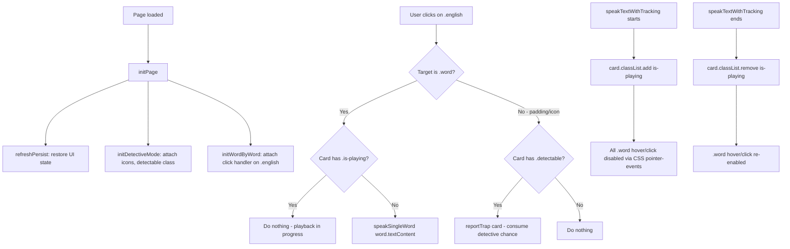

# Word-by-Word Pronunciation Feature Plan

## Overview

Add interactive word-by-word pronunciation to the generated practice page. Each English word becomes a clickable entity that speaks itself using the existing TTS engine.

---

## Changes Required

All changes are within [`script.js`](../script.js)'s `generatePage()` function — specifically the **generated page template** (the `pageTemplate` string starting at line 246).

### 1. Word Wrapping in Template HTML (`generatePage()`)

**Current** (line 209):
```js
const englishDisplay = englishText.replace(/\n/g, '<br>');
```

**New**: Add a `wrapWords()` helper inside the generated `<script>` section, then use it:

```js
function wrapWords(text) {
  // Wrap each non-whitespace sequence (word) in <span class="word">
  return text.replace(/\S+/g, '<span class="word">$&</span>');
}
```

Then in the HTML template (line 226):
```js
<div class="english" id="${englishElementId}">${wrapWords(englishDisplay)}</div>
```

The ordering: `englishDisplay` converts `\n` → `<br>` first, then `wrapWords()` wraps each word in `<span class="word">`, preserving `<br>` tags.

### 2. CSS Additions (inside generated `<style>`)

Add new rules before `@media` queries:

```css
/* Word-by-word interactive styles */
.word {
  cursor: pointer;
  padding: 1px 2px;
  border-radius: 4px;
  transition: background-color 0.15s ease;
}
.word:hover {
  background-color: #fff3cd;  /* light yellow */
}

/* Disable word interactions during sentence playback */
.is-playing .word {
  pointer-events: none !important;
  cursor: default !important;
  background: none !important;
}
```

**Why `pointer-events: none`**: This CSS-based approach is the key trick. When `.is-playing` is on the `.card`, ALL `.word` spans inside become unclickable/unhoverable — no JS event guards needed. Removes cleanly when playback ends.

### 3. `.is-playing` Class Management in `speakTextWithTracking()`

**Add at function start** (after `speechSynthesis.cancel()`):
```js
cardElement.classList.add('is-playing');
```

**Remove in `onend`** of the last segment:
```js
cardElement.classList.remove('is-playing');
```

**Remove in `onerror`** of the last segment:
```js
cardElement.classList.remove('is-playing');
```

### 4. Refactor `initDetectiveMode()` — Remove Separate Click Handler

**Current**: Each `.english` div gets its own click listener for trap reporting.

**New**: Remove the `addEventListener('click', ...)` call from `initDetectiveMode()`. The trap detection logic will be merged into the word-by-word handler instead. Keep everything else in `initDetectiveMode()` (chance display, icon attachment, `detectable` class management).

### 5. New `initWordByWord()` Function (Event Delegation)

One unified click handler on each `.english` container:

```js
function initWordByWord() {
  document.querySelectorAll('.english').forEach(englishDiv => {
    englishDiv.addEventListener('click', function(e) {
      if (!this.classList.contains('visible')) return;
      const card = this.closest('.card');

      // (A) Word-by-word pronunciation
      const wordSpan = e.target.closest('.word');
      if (wordSpan && !card.classList.contains('is-playing')) {
        speakSingleWord(wordSpan.textContent);
        return;  // ← prevents trap detection on word clicks
      }

      // (B) Trap detection (click on non-word area like padding/icon)
      if (this.classList.contains('detectable')) {
        reportTrap(card);
      }
    });
  });
}
```

**Key design**: When a `.word` is clicked, it pronounces it and `return`s early, preventing the trap `reportTrap()` from firing. Trap detection still works by clicking on non-word areas (the 🔍 detective icon, padding, whitespace).

### 6. New `speakSingleWord()` Function

```js
function speakSingleWord(word) {
  if (!('speechSynthesis' in window)) return;
  const utterance = new SpeechSynthesisUtterance(word);
  const maleVoiceName = maleVoiceSelect.value;
  const rate = parseFloat(speedSelect.value) || 0.7;
  let targetVoice = null;
  if (maleVoiceName) targetVoice = availableVoices.find(v => v.name === maleVoiceName);
  if (targetVoice) { utterance.voice = targetVoice; utterance.lang = targetVoice.lang; }
  else { utterance.lang = 'en-US'; }
  utterance.rate = rate;
  window.speechSynthesis.speak(utterance);
}
```

Uses the currently selected male voice (default TTS voice for the page) and the selected speed.

### 7. Wire Up in `initPage()`

Add a call to `initWordByWord()` in `initPage()` (after `initDetectiveMode()` call):

```js
function initPage() {
  // ... existing steps 1-3 ...
  initDetectiveMode();
  initWordByWord();  // ← NEW
}
```

---

## Interaction Flow Diagram



---

## Conflict Analysis

| Existing Feature | Conflict? | Resolution |
|---|---|---|
| **Trap detection (click on `.english`)** | Yes — word clicks would also trigger `reportTrap()` | Merged into single handler; word clicks `return` early, only non-word clicks fall through to `reportTrap()` |
| **Two-Strike auto-reveal** | No — independent of word clicks | Untouched |
| **Energy bar** | No — independent of word clicks | Untouched |
| **Reveal button** | No — word clicks don't affect button state | Untouched |
| **Detective chance display** | No — only consumed by `reportTrap()` | Untouched |

---

## Risk Mitigation

1. **Punctuation attached to words**: Regex `\S+` will wrap "world!" as one span. TTS handles punctuation fine (e.g., "world!" is pronounced correctly).
2. **Multi-line sentences**: `\n` → `<br>` conversion happens BEFORE word wrapping, so `<br>` tags stay outside word spans.
3. **Dialogue-parsed segments** (`M: Hello`): The `segments` from `parseDialogues()` are used only for full-sentence playback. Single-word pronunciation uses the raw text content from the span, skipping the dialogue parser — that's correct for individual words.
