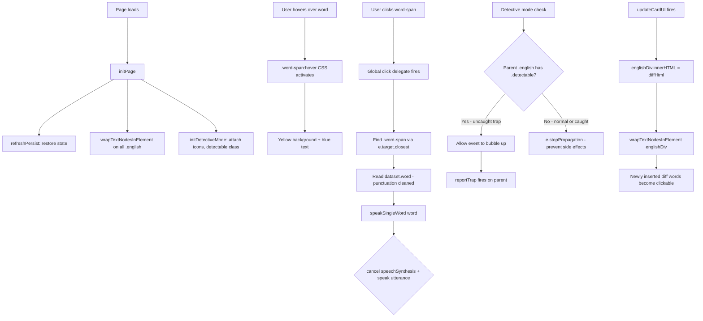

# Plan: Word Hover Highlight + Click to Pronounce

## Overview

Add interactive word-by-word functionality to the generated practice page. Each English word becomes hoverable (highlighted) and clickable (pronounces itself via existing TTS engine). The solution uses **runtime DOM traversal** (`wrapTextNodesInElement`) to wrap words, making it compatible with dynamically-updated content (e.g., detective mode diff correction).

---

## Analysis: User's Approach vs Existing Plan

The existing [`plans/word_by_word_pronunciation.md`](plans/word_by_word_pronunciation.md) used a **build-time regex wrapping** approach in [`main.js`](js/main.js:23). The user's approach is superior for the following reasons:

| Aspect | Existing Plan (build-time) | User's Plan (runtime) |
|---|---|---|
| **Word wrapping** | Regex `\S+` in `main.js` at HTML generation time | JS DOM walker in generated page at runtime |
| **Dynamic content** | ❌ Cannot handle `englishDiv.innerHTML = diffHtml` updates | ✅ `wrapTextNodesInElement(englishDiv)` called after every `innerHTML` change |
| **Detective mode** | Merged click handler — complex logic | Clean separation via `e.stopPropagation()` with `.detectable` check |
| **Punctuation** | Punctuation stays attached to words | ✅ Cleans punctuation for `dataset.word` (cleaner TTS) |
| **Event handling** | Per-container `addEventListener` (re-attach needed after DOM changes) | ✅ Global `document` delegation — works for all `.word-span` elements now and future |
| **`<del>`/`<ins>` preservation** | Not considered | ✅ Explicitly skips element nodes, walks only TEXT_NODEs |

---

## Files to Modify

### 1. [`js/templates/generated-css.js`](js/templates/generated-css.js)

**Insertion point**: After line 19 (`.english.detectable:hover` block), before line 20 (`.chinese` block).

```css
.word-span {
    display: inline-block;
    cursor: pointer;
    transition: background-color 0.2s ease, color 0.2s ease;
    border-radius: 3px;
    padding: 0 2px;
    position: relative;
    z-index: 10;
    pointer-events: auto !important;
}
.word-span:hover {
    background-color: rgba(255, 235, 59, 0.4);
    color: #0d47a1;
}
```

This adds a yellow highlight on hover with a blue text color change, using `inline-block` for proper hit target sizing and `transition` for smooth animation.

---

### 2. [`js/templates/generated-js.js`](js/templates/generated-js.js)

#### 2a. Add three new function blocks

**Insertion point**: After line 578 (end of `speakTextWithTracking` function `}`), before line 580 (start of `showPersistentHint` function).

Insert the following three functions:

**Block 1 — `wrapTextNodesInElement(element)`**:
Recursive DOM walker that finds `TEXT_NODE`s, splits them by whitespace, and wraps each word in a `<span class="word-span">` with a `data-word` attribute (punctuation cleaned). It preserves existing element nodes (like `<del>`, `<ins>`, `<br>`) without modification.

**Block 2 — `speakSingleWord(word)`**:
Uses `SpeechSynthesisUtterance` with the page's currently selected voice (from `femaleVoiceSelect`) and speed (from `speedSelectGenerated`). Calls `speechSynthesis.cancel()` first to stop any ongoing playback.

**Block 3 — Global click delegate**:
`document.addEventListener('click', ...)` checks `e.target.closest('.word-span')`. If found, calls `speakSingleWord()`. Then checks if the parent `.english` div has the `.detectable` class (uncaught trap). If it's a detectable trap, allows the event to bubble up (so `reportTrap()` fires). If not detectable, calls `e.stopPropagation()` to prevent unwanted side effects.

#### 2b. Add `wrapTextNodesInElement` call in `initPage()`

**Location**: [`generated-js.js` line ~868-872](js/templates/generated-js.js:854) — inside the `initPage()` function.

After `refreshPersist();` (line ~868) and before `initDetectiveMode();` (line ~871), add:
```js
// Step 2.5: Wrap words for hover + click-to-pronounce
document.querySelectorAll('.english').forEach(el => wrapTextNodesInElement(el));
```

#### 2c. Add `wrapTextNodesInElement` call in `updateCardUI()`

**Location**: [`generated-js.js` line ~139](js/templates/generated-js.js:139) — inside the `if (trapState.isCaught)` branch.

After `englishDiv.innerHTML = diffHtml;` (line ~139), add:
```js
wrapTextNodesInElement(englishDiv);
```

This ensures that after `computeDiff` replaces the HTML with corrected text, the words in that diff output also become clickable.

---

## Interaction Flow



---

## Conflict Analysis with Existing Features

| Feature | Conflict? | Resolution |
|---|---|---|
| **Trap detection** (click on `.english.detectable`) | Yes — word clicks on traps would also trigger `reportTrap()` | Global handler checks `.detectable` parent: if present, lets event bubble to trigger `reportTrap()`; otherwise `stopPropagation()` |
| **Two-Strike auto-reveal** | No — independent of word clicks | Untouched |
| **Energy bar / mastery** | No — word clicks don't affect stats | Untouched |
| **Reveal button** | No — word clicks don't interfere | Untouched |
| **Sentence playback** (`speakTextWithTracking`) | No — `speakSingleWord` calls `cancel()` which stops sentence playback, but that's expected behavior | No change needed |
| **`<br>` tags in multi-line text** | No — `wrapTextNodesInElement` only processes `TEXT_NODE`; `<br>` elements are preserved | Correct by design |
| **`<del>`/`<ins>` in diff HTML** | No — element nodes are recursed into but not re-wrapped if they already have `.word-span` | Guard: `if (!node.classList.contains('word-span'))` |

---

## Modification Summary Table

| # | File | Location | Change |
|---|---|---|---|
| 1 | [`generated-css.js`](js/templates/generated-css.js) | After line 19 | Insert `.word-span` CSS rules |
| 2 | [`generated-js.js`](js/templates/generated-js.js) | After line 578 | Insert `wrapTextNodesInElement`, `speakSingleWord`, global click delegate |
| 3 | [`generated-js.js`](js/templates/generated-js.js) | Inside `initPage()`, line ~869 | Call `wrapTextNodesInElement` on all `.english` |
| 4 | [`generated-js.js`](js/templates/generated-js.js) | Inside `updateCardUI()`, after line ~139 | Call `wrapTextNodesInElement(englishDiv)` after `innerHTML = diffHtml` |
